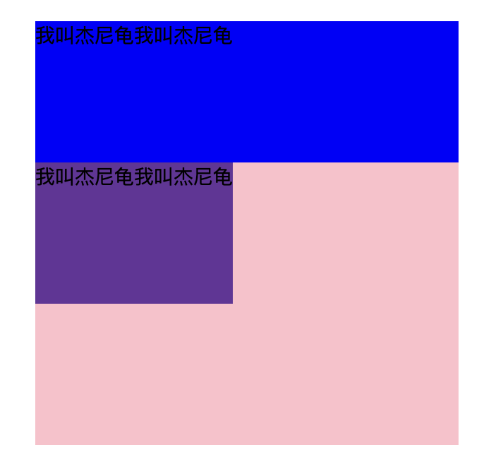
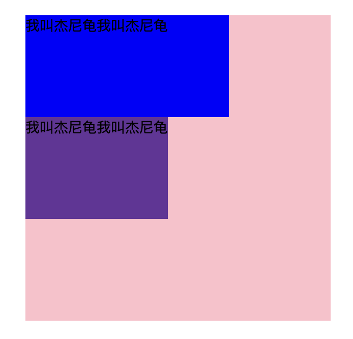
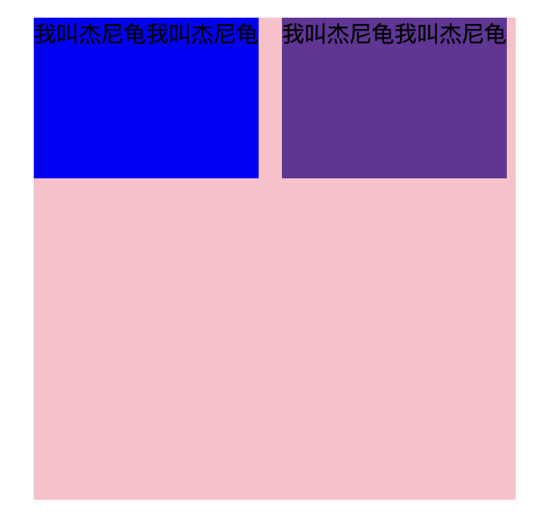

# 基础篇4

## CSS_03

### 1. CSS的三大特性

CSS有三个非常重要的特征：层叠性、继承性、优先级。

#### 1）层叠性

CSS层叠性（Cascading Style Sheets, CSS）是指在Web页面中，当多个样式规则应用于同一个元素时，浏览器通过一系列规则来确定最终样式的过程。

层叠性原则：

- 样式冲突，遵循的原则是**就近原则**（下覆盖上），哪个样式离结构近，就执行哪个样式

- 样式不冲突，不会层叠

> 我爱你三千遍

#### 2）继承性

CSS中的继承：子标签会继承父标签的某些样式，如文本颜色和字号。简单理解就是：子承父业。

**行高的继承**

- 行高可以跟单位也可以不跟单位
- 当前子元素的文字大小 `*1.5`

```css
body {
  font: 12px/1.5 Microsoft YaHei;
}
```

继承规则：`1.5*12px`

#### 3）优先级

当同一个元素指定多个选择器，就会有优先级的产生。

- 选择器相同，则执行层叠性
- 选择器不同，则根据**选择器权重**执行

| 选择器                 | 选择器权重 |
| ---------------------- | ---------- |
| 继承 或者 *            | 0 0 0 0    |
| 元素选择器             | 0 0 0 1    |
| 类选择器 伪类选择器    | 0 0 1 0    |
| ID选择器               | 0 1 0 0    |
| 行内样式 `style = "" ` | 1 0 0 0    |
| `!important` 重要的    | ∞ 无穷大   |

**权重的叠加**

如果是复合选择器，则会有权重叠加，需要计算权重。

例如：

```css
ul li {
	color: green;
}
/* ul li 权重 0 0 0 1 + 0 0 0 1 = 0 0 0 2 */
li {
	color: red;
}
/* li 权重 0 0 0 1 */
```

### 2. 盒子模型

#### 1）盒子模型

页面布局三大核心，盒子模型、浮动、定位。

网页布局过程：

1. 先准备好相关的网页元素，网页元素基本都是盒子box。
2. 利用CSS设置好盒子样式，然后摆放到相应位置。
3. 往盒子里面装内容。

网页布局的核心本质：利用CSS摆盒子。

##### 2.1.1 盒子模型组成

盒子模型由内到外分为四个部分：

1. **内容区域（Content）：** 这是盒子内部用于显示实际内容的区域，例如文本、图片等。内容区域的大小由元素的`width`和`height`属性决定。
2. **内边距区域（Padding）：** 内边距是指内容区域与边框之间的空间，用来控制元素内容与边框的距离。内边距的大小由元素的`padding`属性决定。
3. **边框区域（Border）：** 边框包围在内边距外部，用于定义元素的边界。边框的大小和样式由元素的`border`属性决定。可以分别设置上、右、下、左四个方向的边框。
4. **外边距区域（Margin）：** 外边距是指边框与相邻元素之间的空间，用于控制元素与其他元素的距离。外边距的大小由元素的`margin`属性决定。

##### 2.1.2 边框（border）

在CSS中，边框的属性主要包括`border-width`、`border-style`和`border-color`，以及它们的缩写`border`。

以下是边框区域的主要属性：

**1 边框宽度 (`border-width`)：** 控制边框的宽度。可以设置单独的上、右、下、左边框宽度，也可以使用缩写属性同时设置四个方向的宽度。例如：

```css
/* 单独设置四个方向的边框宽度 */
border-top-width: 2px;
border-right-width: 1px;
border-bottom-width: 3px;
border-left-width: 1px;

/* 或者使用缩写属性设置四个方向的宽度 */
border-width: 2px 1px 3px 1px;
```

上述缩写属性按顺序表示上、右、下、左四个方向的边框宽度。

**2 边框样式 (`border-style`)：** 控制边框的样式，可以设置为`none`、`solid`、`dashed`、`dotted`等。例如：

```css
/* 设置所有边框的样式为实线 */
border-style: solid;

/* 分别设置四个方向的边框样式 */
border-top-style: dashed;
border-right-style: dotted;
border-bottom-style: double;
border-left-style: groove;
```

**`solid`：** 实线边框。

**`dashed`：** 虚线边框。

**`dotted`：** 点线边框。

**3 边框颜色 (`border-color`)：** 控制边框的颜色。可以设置单独的上、右、下、左边框颜色，也可以使用缩写属性同时设置四个方向的颜色。例如：

```css
/* 单独设置四个方向的边框颜色 */
border-top-color: #ff0000; /* 红色 */
border-right-color: #00ff00; /* 绿色 */
border-bottom-color: #0000ff; /* 蓝色 */
border-left-color: #000000; /* 黑色 */

/* 或者使用缩写属性设置四个方向的颜色 */
border-color: #ff0000 #00ff00 #0000ff #000000;
```

上述缩写属性按顺序表示上、右、下、左四个方向的边框颜色。

**4 边框缩写 (`border`)：** 用于同时设置边框的宽度、样式和颜色。例如：

```css
/* 设置所有边框的宽度、样式和颜色 */
border: 2px dashed #333;

/* 设置分别四个方向的宽度、样式和颜色 */
border: 2px solid #000;
border-top: 1px dotted #666;
border-right: 3px double #999;
```

**5 `border-collapse`**属性：

**合并相邻边框**指在元素的两个相邻边界上共享一个边框。这个特性主要适用于**表格**的单元格，以及一些其他具有相邻边框的情况。

1. **`separate`（默认值）：** 表格单元格边框不会合并，相邻的边框会保持独立。

```css
table {
  border-collapse: separate;
}
```

2. **`collapse`：** 表格单元格的相邻边框会合并为一个单一的边框。

```css
table {
  border-collapse: collapse;
}
```

这个属性更多地用于表格，特别是在处理相邻单元格边框时。

以下是一个表格边框合并的例子：

```css
table {
  border-collapse: collapse;
}

td, th {
  border: 1px solid #000;
}
```

在这个例子中，`border-collapse: collapse;`告诉浏览器合并表格的边框。表格内的`td`和`th`元素都有一个`1`像素的实线边框，由于`border-collapse`的设置，相邻单元格的边框会合并为一个。

> border 会影响盒子实际大小

##### 2.1.3 内边距（padding）

内边距可以在元素的四个方向（上、右、下、左）设置，分别控制元素内容与边框之间的距离。内边距通过`padding`属性进行设置。

内边距的语法如下：

```css
/* 设置所有方向的内边距 */
padding: value;

/* 分别设置上、右、下、左方向的内边距 */
padding-top: value;
padding-right: value;
padding-bottom: value;
padding-left: value;
```

- `value` 可以是长度值（如像素、百分比、em等）或者关键字（如`auto`）。

以下是一些例子：

```css
/* 设置所有方向的内边距为10像素 */
padding: 10px;

/* 分别设置上、右、下、左方向的内边距为10像素 */
padding-top: 10px;
padding-right: 20px;
padding-bottom: 30px;
padding-left: 40px;
```

以下是 `padding` 复合属性的使用示例：

```css
/* 设置上下方向的内边距为10像素，左右方向的内边距为20像素 */
.element {
  padding: 10px 20px;
}

/* 设置上、右、下、左方向的内边距为10、20、30、40像素 */
.element {
  padding: 10px 20px 30px 40px;
}
```

如果只设置一个值，表示所有方向的内边距都相同。如果设置两个值，表示上下方向和左右方向的内边距。如果设置三个值，表示上、左右方向、下的内边距。如果设置四个值，表示上、右、下、左方向的内边距。

> `padding` 会影响盒子实际大小 相当于加大盒子 换取边距

如果盒子已经有了宽度和高度，此时再指定内边框，会撑大盒子。

`div` 中包含 `p` 因为 `p` 是块级元素，所以它和父级一样宽，这是块级元素独显一行的特点，不是继承，高度宽度不能继承。

块元素高度为**内容高度**。

如果盒子本身没有指定 `width / height` 属性，则此时 `padding` 不会撑开盒子大小。

##### 2.1.4 外边距（margin）

外边距可以在元素的四个方向（上、右、下、左）设置，分别控制元素与相邻元素之间的距离。外边距通过`margin`属性进行设置。

外边距的语法如下：

```css
/* 设置所有方向的外边距 */
margin: value;

/* 分别设置上、右、下、左方向的外边距 */
margin-top: value;
margin-right: value;
margin-bottom: value;
margin-left: value;
```

- `value` 可以是长度值（如像素、百分比、em等）或者关键字（如`auto`）。

以下是一些例子：

```css
/* 设置所有方向的外边距为10像素 */
margin: 10px;

/* 分别设置上、右、下、左方向的外边距 */
margin-top: 10px;
margin-right: 20px;
margin-bottom: 30px;
margin-left: 40px;
```

外边距的作用包括：

1. **空间隔离：** 外边距可以在元素和相邻元素之间创建空隙，使元素在页面布局中更具灵活性。
2. **垂直居中：** 外边距可以用于在垂直方向上将元素居中，特别是在垂直方向上的外边距为`auto`时。

> 复合属性同 `padding`

注意：`margin` 是让块级元素水平居中，行内元素或者行内块元素水平居中，要给其父元素添加 `text-align:center` 即可。

##### 2.1.5 注意事项

**嵌套块元素垂直外边距的塌陷（重要）**

对于两个嵌套关系**（父子关系）**的块元素，父元素有上外边距同时子元素也有上外边距，此时父元素会塌陷较大的外边距值。

**垂直外边距塌陷的规则：**

1. **相邻块级元素：** 只有相邻的块级元素之间的垂直外边距会发生塌陷，即它们之间**没有内容、内边距或边框**。
2. **取较大值：** 垂直外边距的塌陷会取相邻块级元素的外边距的最大值，而不是简单相加。

解决方案：

1. 可以为父元素定义上边框（`transparent`）。
2. 可以为父元素定义上内边距。
3. 可以为父元素添加 `overflow:hidden` 。

**清除内外边距**

网页元素很多都带有默认的内外边距，而且不同浏览器默认的也不一样。因此我们在布局前，首先要清楚下网页元素的内外边距。

```css
/* 这句话也是我们css的第一行代码 */
* {
	padding:0;	/* 清除内边距 */
  margin:0;		/* 清除外边距 */
}
```

行内元素只设置左右的内外边距，不要设置上下内外边距。但是转换为块级和行内块元素就可以了。

**行内块元素**

盒子宽度和元素宽度一致。

#### 2）案例总结

```css
<style>
    * {
        margin: 0px;
        padding: 0px;
    }
    .nav {
        font-family: 微软雅黑;
        font-size: 14px;
        width: 300px;
        height: 300px;
        background-color: pink;
        margin: 100px auto;
    }
    p {
        /* width: 100%; 与父类同宽 */
        /* width: 200px; 同设置宽度 */
        /* 不设置 与元素同宽 */
        height: 100px;
        display: inline-block;
        background-color: blue;
        margin-right: 10px;
        /* margin-right: 20px; 边距太大 最外层盒子装不下 自动换行 */
    }
    span {
        display: inline-block;
        height: 100px;
        background-color: rebeccapurple;
    }
</style>
```

```html
<div class="nav">
    <p>
        我叫杰尼龟我叫杰尼龟
    </p>
    <span>
        我叫杰尼龟我叫杰尼龟
    </span>
</div>
```

> 注意事项见注释

附图如下：

<div align="center">     
	     
       
  
</div>
去掉 `li` 前面的项目符号（小圆点），语法：`list-style: none;`

### 3. 圆角边框（重点）

在 CSS 中，可以使用 `border-radius` 属性来实现圆角边框。

**`border-radius` 属性：**

该属性用于设置元素的边框圆角。它可以接受一个或多个长度值，也可以是百分比。

语法：

```css
border-radius: value1 value2 value3 value4;
```

1. 圆形的做法：
   首先盒子要是个正方形，其次让 `border-radius` 等于盒子一半宽。

2. 圆角矩形的做法：

   `border-radius` 等于盒子一半高。

- 如果提供一个值，则四个角都会使用相同的圆角半径。
- 如果提供四个值，它们依次应用于左上、右上、右下、左下四个角的圆角半径。

> 顺时针方向

- 如果提供两个数值，它们依次应用于主对角线、次对角线上的圆角搬家。

- **`border-top-left-radius`、`border-top-right-radius`、`border-bottom-right-radius`、`border-bottom-left-radius`：** 也可以单独设置每个角的圆角半径。

### 4. 盒子阴影（重点）

通过 `box-shadow` 属性，可以为元素添加投影效果，从而使元素在页面上脱颖而出。

**`box-shadow` 属性：**

语法：

```css
box-shadow: [inset] <offset-x> <offset-y> [blur-radius] [spread-radius] [color];
```

- `inset`（可选）：表示阴影是内部阴影（元素内部产生的阴影）还是外部阴影（元素外部产生的阴影），默认 `outset`。
- `<offset-x>` 和 `<offset-y>`：表示阴影的水平和垂直偏移。正值表示向右或向下，负值表示向左或向上。
- `blur-radius`（可选）：表示阴影的模糊半径，值越大，阴影越模糊（阴影虚实）。默认为 0（实）。
- `spread-radius`（可选）：表示阴影的尺寸，正值扩展阴影，负值收缩阴影。默认为 0。
- `color`（可选）：表示阴影的颜色。

使用 `rgba` 添加透明度：

```css
div {
  box-shadow: 5px 5px 10px rgba(0, 0, 0, 0.5);
}
```

通过使用 `rgba` 表示颜色，可以为阴影添加透明度效果。

注意：盒子阴影不占用空间，不会影响其他盒子排列。

原先盒子没有阴影，当鼠标经过盒子，就添加**阴影效果**。

> 任何盒子都能添加 `:hover`

### 5. 文字阴影

字阴影通过 `text-shadow` 属性实现，这个属性允许你定义水平偏移、垂直偏移、模糊半径和颜色。

语法：

```css
text-shadow: <offset-x> <offset-y> <blur-radius> <color>;
```

- `<offset-x>` 和 `<offset-y>`：表示阴影的水平和垂直偏移。正值表示向右或向下，负值表示向左或向上。
- `<blur-radius>`：表示阴影的模糊半径，值越大，阴影越模糊。默认为 0。
- `<color>`：表示阴影的颜色。可以使用颜色名称、十六进制、RGB、RGBA 等表示颜色的方式。

**使用 `rgba` 添加透明度：**

```css
h1 {
  text-shadow: 2px 2px 4px rgba(0, 0, 0, 0.5);
}
```


